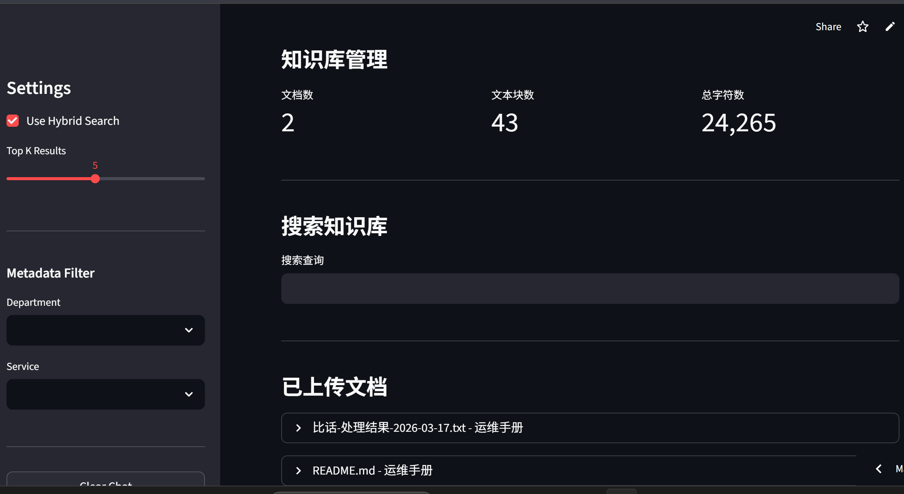
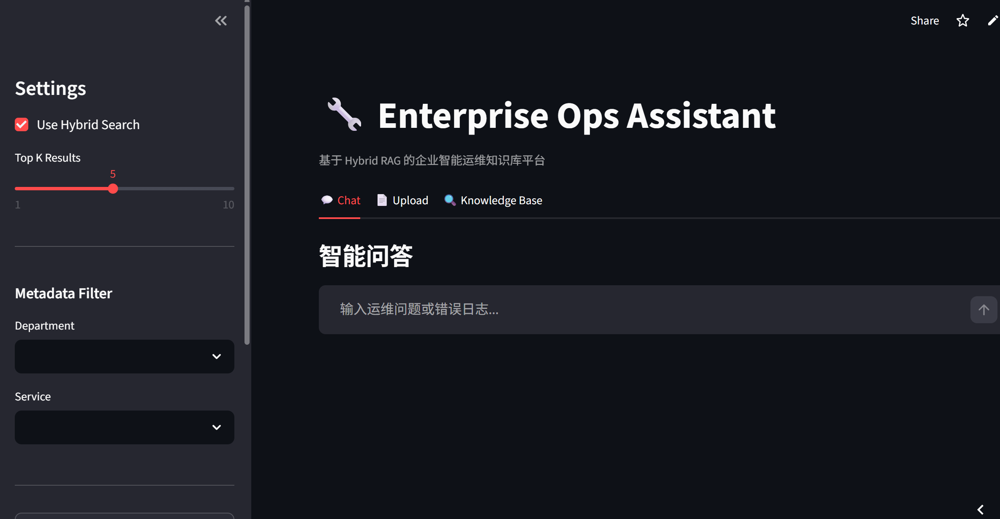
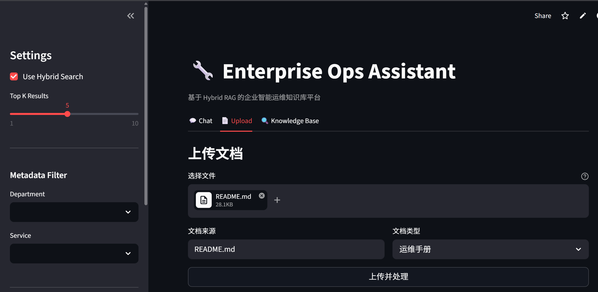

# 🚀 Enterprise Intelligent Ops Assistant Based on Hybrid RAG

> 基于 Hybrid RAG 的企业级智能运维知识库平台
> Enterprise-level Intelligent Operations Knowledge Base Platform Powered by Hybrid Retrieval-Augmented Generation

---

## 🔗 在线体验

| 平台 | 链接 |
|------|------|
| **Demo** | [https://hybrid-rag-bwavseqimnwazuxtwoqrm9.streamlit.app](https://hybrid-rag-bwavseqimnwazuxtwoqrm9.streamlit.app) |
| **GitHub** | [https://github.com/1480735780/-Hybrid-RAG-](https://github.com/1480735780/-Hybrid-RAG-) |
| **Gitee** | [https://gitee.com/Easonlu01/hybrid-rag](https://gitee.com/Easonlu01/hybrid-rag) |

---

## 📌 Project Introduction

本项目聚焦于企业运维场景，构建了一套基于 **Hybrid RAG（Retrieval-Augmented Generation）** 的智能运维知识库平台，用于解决传统运维场景中：

* 📄 文档检索效率低
* 🔍 故障定位困难
* 🧩 日志分析复杂
* 🛠️ 运维经验无法沉淀
* ⏳ 人工排查耗时长

等问题。

系统支持：

* Linux 运维
* Docker 故障分析
* MySQL 异常诊断
* Kubernetes 问题定位
* Nginx 日志分析
* 企业内部知识问答

---

## 📸 项目截图

### 智能问答界面


### 文档上传界面


### 知识库管理


---

用户输入报错日志、异常信息或运维问题后，系统能够：

✅ 自动检索知识库
✅ 分析日志内容
✅ 识别错误原因
✅ 生成修复方案
✅ 推荐 Shell 命令
✅ 给出来源引用

---

# 🏗️ System Architecture

```text
                           ┌────────────────────┐
                           │    User Web UI     │
                           │ Vue3 / Streamlit   │
                           └─────────┬──────────┘
                                     │
                                     ▼
                     ┌──────────────────────────┐
                     │      FastAPI Gateway      │
                     │      RESTful API          │
                     └─────────┬────────────────┘
                               │
             ┌─────────────────┴──────────────────┐
             ▼                                    ▼

┌────────────────────────┐         ┌────────────────────────┐
│   Document Pipeline     │         │   Hybrid Retrieval      │
│                        │         │                        │
│ PDF / DOCX / TXT Parse │         │ BM25 Retrieval         │
│ Chunk Splitting        │         │ Vector Search          │
│ Metadata Processing    │         │ Hybrid Fusion          │
└────────────┬───────────┘         └──────────┬─────────────┘
             │                                │
             ▼                                ▼

┌────────────────────────┐         ┌────────────────────────┐
│ Embedding Module        │         │    Rerank Engine        │
│                        │         │                        │
│ BGE-M3 Embedding       │         │ BGE-Reranker           │
│ Semantic Vectorization │         │ Top-K Optimization     │
└────────────┬───────────┘         └──────────┬─────────────┘
             │                                │
             ▼                                ▼

┌────────────────────────┐         ┌────────────────────────┐
│ Vector Database         │         │      LLM Module         │
│                        │         │                        │
│ ChromaDB / Milvus      │         │ Qwen2.5 / DeepSeek     │
│ Similarity Retrieval   │         │ Prompt Engineering     │
└────────────────────────┘         └────────────────────────┘

                               │
                               ▼

                ┌────────────────────────────────┐
                │  Answer + Source Citation      │
                │                                │
                │  ✔ Fault Diagnosis             │
                │  ✔ Repair Suggestions          │
                │  ✔ Shell Commands              │
                │  ✔ Knowledge References        │
                └────────────────────────────────┘
```

---

# ✨ Core Features

## 📚 Knowledge Base Construction

* ✅ PDF / DOCX / TXT / Markdown 导入
* ✅ 文档解析与清洗
* ✅ Chunk 智能切分
* ✅ Metadata 构建
* ✅ 向量化存储

---

## 🔍 Hybrid Retrieval

实现：

* BM25 Keyword Retrieval
* Dense Vector Retrieval
* Hybrid Fusion Retrieval

解决运维场景中：

```bash
ERROR 2002
mysqld.sock
docker daemon
nginx.conf
```

等关键词无法被纯向量检索精准召回的问题。

---

## 🧠 Rerank Optimization

系统引入：

* BGE-Reranker

流程：

```text
Top20 Recall
   ↓
Rerank
   ↓
Top3 Context
   ↓
LLM Generation
```

有效提升上下文质量与回答准确率。

---

## 📄 Intelligent Log Analysis

支持：

* Docker Logs
* MySQL Logs
* Linux Error Logs
* Nginx Logs

实现：

✅ 错误码提取
✅ 异常定位
✅ 故障分析
✅ 修复建议生成

---

## 💬 Multi-turn Conversation Memory

支持：

* Chat History
* Context Memory
* Multi-turn QA

例如：

```text
User:
mysql 启动失败

User:
ERROR 2002
```

系统能够自动关联上下文。

---

## 🔐 Metadata Permission Filtering

支持：

```json
{
  "department": "ops",
  "service": "mysql",
  "level": "P1"
}
```

实现企业级权限检索过滤。

---

## 📖 Source Citation

回答附带：

* 文档来源
* 页码
* chunk 来源

例如：

```text
Source:
《MySQL 故障处理手册》第12页
```

增强企业场景可信度。

---

# 🛠️ Tech Stack

| Module        | Technology             |
| ------------- | ---------------------- |
| Backend       | FastAPI                |
| RAG Framework | LangChain              |
| Embedding     | BGE-M3                 |
| Vector DB     | ChromaDB / Milvus      |
| Retrieval     | BM25 + Dense Retrieval |
| Rerank        | BGE-Reranker           |
| LLM           | Qwen2.5 / DeepSeek     |
| Database      | MySQL                  |
| Frontend      | Vue3 / Streamlit       |
| Deployment    | Docker                 |

---

# 📂 Project Structure

```text
RAG_Agent_Project/
│
├── backend/
│   ├── api/
│   ├── rag/
│   ├── retrieval/
│   ├── rerank/
│   ├── memory/
│   ├── llm/
│   ├── prompt/
│   └── utils/
│
├── frontend/
│
├── knowledge_base/
│
├── vector_store/
│
├── logs/
│
├── docker/
│
├── tests/
│
├── requirements.txt
│
└── README.md
```

---

# 🚀 Future Roadmap

## Phase 1 — MVP

* [x] Basic RAG
* [x] Document Upload
* [x] Vector Search
* [x] Source Citation

---

## Phase 2 — Enterprise Retrieval

* [ ] Hybrid Retrieval
* [ ] Rerank Optimization
* [ ] Query Rewrite

---

## Phase 3 — AI Agent

* [ ] Agent Workflow
* [ ] Shell Command Agent
* [ ] MCP Tool Calling

---

## Phase 4 — Enterprise Upgrade

* [ ] Multi-tenant Knowledge Base
* [ ] RBAC Permission System
* [ ] Redis Cache
* [ ] Kubernetes Deployment

---

# 🎯 Project Highlights

✅ 企业级 Hybrid RAG 架构
✅ BM25 + Vector Search 混合检索
✅ BGE-Reranker 重排序优化
✅ 智能日志分析能力
✅ 多轮上下文记忆
✅ 企业级模块化工程设计
✅ Docker 容器化部署
✅ 支持后续 Agent 化扩展

---

# 📈 Resume Description

> 基于 Hybrid RAG 构建企业级智能运维知识库平台，采用 BM25 与向量检索融合架构，并结合 BGE-Reranker 提升召回质量，实现运维知识问答、日志分析、故障诊断与来源溯源功能，支持 Docker、Linux、MySQL 等典型企业运维场景。

---

# ⭐ Star History


[](https://star-history.com/#1480735780/Hybrid-RAG&Date)
如果这个项目对你有帮助，欢迎 Star ⭐

---

# 📄 License

MIT License
